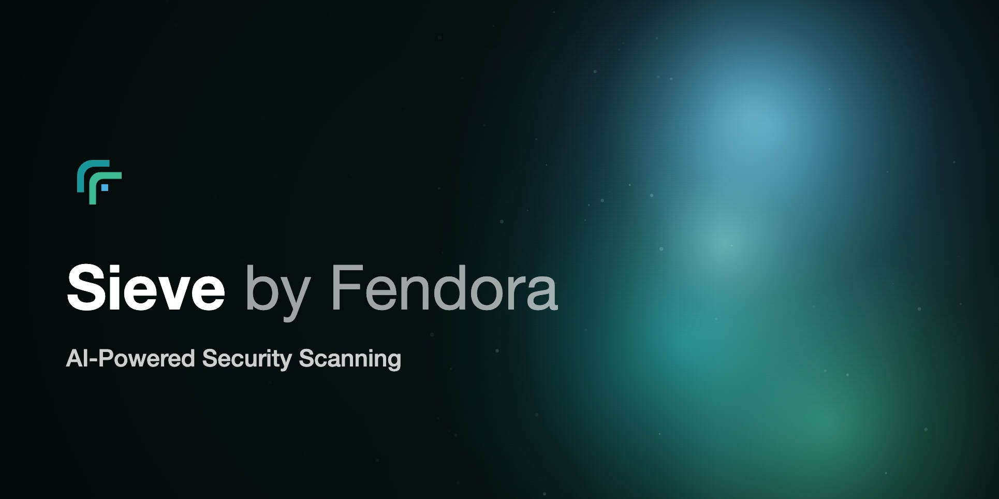

<p align="center">
  
</p>

# Sieve by Fendora

**GitHub Action · AI-powered security scanning for pull requests.** Sieve finds real vulnerabilities and suppresses false positives — so your team focuses on issues that actually matter.

> Built by [Fendora UG (haftungsbeschränkt)](https://fendora.io)

[](https://scorecard.dev/viewer/?uri=github.com/fendora-io/sieve-action)
[](https://www.bestpractices.dev/en/projects/13597)
[](https://www.bestpractices.dev/projects/13597)

---

## Usage

```yaml
name: Security Scan

on:
  pull_request:
    types: [opened, synchronize, reopened]
  issue_comment:
    types: [created]

permissions:
  contents: read
  pull-requests: write

jobs:
  sieve:
    runs-on: ubuntu-latest
    steps:
      - uses: actions/checkout@v4

      - uses: fendora-io/sieve-action@v1.4.4
```

That's it — no setup, no API keys, no configuration required.

## Inputs

| Input | Required | Default | Description |
|-------|----------|---------|-------------|
| `repo-alias` | | repo name | Short name used in scan results |
| `fail-on-findings` | | `true` | Fail the check if real vulnerabilities are found |
| `github-token` | | `github.token` | Token used to post PR comments |

## Outputs

| Output | Description |
|--------|-------------|
| `total` | Total findings scanned |
| `flagged` | Findings Sieve considers likely real |
| `scan-id` | Unique ID for this scan |

## Example PR comment

When Sieve finds issues it posts a comment on the PR:

```
## Sieve Security Scan ⚠️

2 finding(s) flagged as likely real — the rest were suppressed as false positives.

| Rule               | File               | Line | Score | Feedback |
|--------------------|--------------------|------|-------|----------|
| `sql-injection`    | `src/db/query.js`  | 42   | 0.94  | 👍 👎    |
| `subprocess-shell` | `scripts/build.py` | 18   | 0.81  | 👍 👎    |

2 real · 14 suppressed · 16 total
```

The 👍 / 👎 links let you mark each finding as a real vulnerability or a false positive. Your feedback is stored anonymously and used to improve the model over time.

When no issues are found:

```
## Sieve Security Scan ✅

No likely vulnerabilities found.

0 real · 9 suppressed · 9 total
```

## Don't fail the build

```yaml
- uses: fendora-io/sieve-action@v1.4.4
  with:
    fail-on-findings: "false"
```

## Data & Privacy

When you use this action, the following is sent to Sieve servers for analysis:

- File paths, line numbers, rule IDs, and matched code snippets from security findings
- Your repo alias (defaults to the GitHub repo name)

**What is never stored:** full source files, raw file paths, or raw code snippets.

**What may be stored server-side** (anonymized, for model improvement): rule IDs, SHA-256 hashed file paths, confidence scores, predicted labels, and any feedback you submit via the 👍/👎 links — no code.

For questions about data handling: **contact@fendora.io**

## Documentation

| Document | Description |
|----------|-------------|
| [docs/ARCHITECTURE.md](docs/ARCHITECTURE.md) | System design, actors, and data flows |
| [docs/DEVELOPMENT.md](docs/DEVELOPMENT.md) | Dependencies, build instructions, and tests |
| [docs/SECURITY-ASSESSMENT.md](docs/SECURITY-ASSESSMENT.md) | Threat summary and attack surface analysis |
| [GOVERNANCE.md](GOVERNANCE.md) | Maintainers, roles, and responsibilities |
| [docs/RELEASE-VERIFICATION.md](docs/RELEASE-VERIFICATION.md) | Verify signed releases and publisher identity |
| [docs/SECURITY-SCANNING-POLICY.md](docs/SECURITY-SCANNING-POLICY.md) | SCA/SAST thresholds and secrets policy |
| [docs/VEX.md](docs/VEX.md) | Non-exploitable vulnerability suppressions |

## Contributing

See [CONTRIBUTING.md](CONTRIBUTING.md). Report security issues via [SECURITY.md](SECURITY.md).

## Contact

Questions or feedback: **contact@fendora.io**

## License

Apache 2.0 — see [LICENSE](LICENSE)

© 2026 Fendora UG (haftungsbeschränkt)
